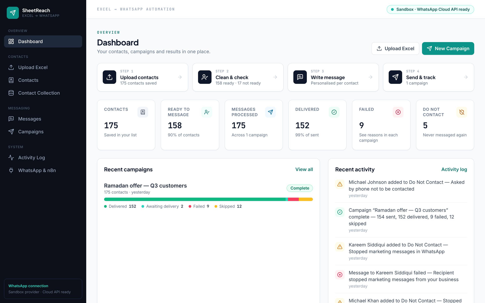

# SheetReach — Excel → WhatsApp Business Automation

**Excel → WhatsApp automation with n8n · WhatsApp Cloud API ready**

Upload a contact list from Excel or CSV. The app cleans it, shows you who can be messaged, sends a personalised WhatsApp message through a queue with retries and opt-out protection, and reports exactly what happened. A **real n8n workflow** can run the whole process automatically.

**Watch:** [`portfolio/video/P07-sheetreach-n8n-demo.mp4`](portfolio/video/P07-sheetreach-n8n-demo.mp4) (2 min 11 s, voiceover) · **Everything in one ZIP:** [`portfolio/P07-SheetReach-Portfolio-Package.zip`](portfolio/P07-SheetReach-Portfolio-Package.zip) · **Case study:** [`portfolio/CASE-STUDY.md`](portfolio/CASE-STUDY.md) · **Slides:** [`portfolio/CLIENT-PRESENTATION.pdf`](portfolio/CLIENT-PRESENTATION.pdf)

> Sample contacts and businesses are generated; phone numbers are random. By default campaigns run on the **sandbox provider** (no messages leave the app). The WhatsApp Cloud API provider switches on with the client's Meta credentials.



## The business problem
A business keeps its customer and lead contacts in Excel. To send a WhatsApp offer today, someone has to:
- clean the sheet by hand (numbers written as `050…`, `+971…`, `00971…`, duplicates, blanks)
- work out who actually agreed to receive messages, and who asked not to be contacted
- copy and paste the same message with each person's name
- keep no reliable record of who received it, who didn't, and why

This is slow and error-prone. It also risks the WhatsApp number: messaging people who opted out leads to blocks.

## The solution
**Contacts → Clean → Validate → Review → Message → Process → Results**

| Step | What the user sees | What happens underneath |
|---|---|---|
| 1. Upload | Drop an `.xlsx`/`.csv` file | Header row found even under title rows, columns detected automatically (name, business, phone, country, opt-in…) |
| 2. Clean | "1,250 rows · 1,092 ready · 41 duplicates · 15 invalid · 18 no number · 12 Do Not Contact · 72 need opt-in" | Numbers normalised to E.164 (`+971501234567`) with `phonenumbers`, deduplicated on the *cleaned* number, checked against the suppression list |
| 3. Review | Row-by-row result with a plain reason; fix a column mapping if needed | Re-analysis on every mapping change; nothing is saved until **Import** |
| 4. Message | Write once with `{{first_name}}`, `{{company}}`, `{{city}}`; live preview | Fallbacks for missing data ("Hi there"); maps to Cloud API named template parameters |
| 5. Review campaign | "You are about to message 1,092 contacts", preview, provider notice → **Start Campaign** | Ineligible contacts are recorded as *Skipped* with the reason |
| 6. Processing | Live progress, pause / resume | Background queue; Do Not Contact re-checked right before each send; temporary errors retried with backoff |
| 7. Results | Processed, sent, delivered, failed, skipped, opted out, plus *why* | Status updates go through the same handler as Meta's status webhook; Excel export |

Also included:
- **Contacts:** search, filters, sorting, status tabs, "why not eligible", recording an opt-in, export.
- **Do Not Contact list:** fed by STOP replies, error 131050, opted-out rows in a file, and manual entries.
- **Contact Collection:** Collect → Clean → Validate → Deduplicate → Review → Export, from a bundled sample business directory. Collected businesses are added as *Needs opt-in* and never messaged automatically.
- **Activity Log:** imports, duplicates, invalid numbers, campaigns, retries, failures and opt-outs.
- **WhatsApp & n8n page:** go-live checklist, environment variables, and the production automation flow.

## Run it
Requirements: Python 3.11+ and Node 18+.
```bash
./run.sh                     # installs, builds the UI, starts on http://localhost:8000
```
Development (hot reload):
```bash
python3 -m venv .venv && .venv/bin/pip install -r backend/requirements.txt
cd backend && ../.venv/bin/uvicorn app.main:app --reload --port 8000     # API + seeded demo data
cd frontend && npm install && npm run dev                                 # UI on http://localhost:5173
```
The first start creates `backend/data/app.db` with sample data: 175 contacts, 3 messages and one completed campaign. **WhatsApp & n8n → Reset sample data** restores it. Sample files to upload are in `sample-data/`, or use the **"Use sample file"** buttons on the upload page.

Tests:
```bash
cd backend && ../.venv/bin/python -m pytest -q            # 41 API/unit tests
node e2e/journey.mjs http://localhost:8000                 # 33 browser checks + screenshots (needs Playwright/Chromium)
N8N_EMAIL=… N8N_PASSWORD=… node e2e/n8n-run.mjs <workflowId>   # runs the n8n workflow in the n8n editor, checks success
```

## What is real and what needs credentials
| Part | Status |
|---|---|
| Excel/CSV import, cleaning, Do Not Contact, personalisation, queue, retries, reports, exports | Built and tested |
| n8n workflow | Built and executed (n8n 2.42.4) |
| Sandbox WhatsApp provider | Built; default for testing (no messages leave the app) |
| WhatsApp Cloud API provider | Built and unit-tested with mocked Meta responses. **Needs the client's** Meta Business account, phone number ID, access token, app secret and approved templates. Not run against Meta |
| Status webhook (`/api/webhooks/whatsapp`) | Built and tested with Meta-format payloads; needs a public URL registered in the client's Meta app |

## Architecture (short)
React + TypeScript + Tailwind (Vite) → FastAPI → SQLAlchemy (SQLite by default; Postgres via `DATABASE_URL`) → `WhatsAppProvider`:
- `DemoWhatsAppProvider` (default sandbox): deterministic test outcomes
- `WhatsAppCloudAPIProvider`: official Graph API `POST /{phone-number-id}/messages`, template messages, enabled only with `WHATSAPP_MODE=cloud_api` **and** credentials

See [ARCHITECTURE.md](ARCHITECTURE.md).

## WhatsApp integration approach
- **Official WhatsApp Business Cloud API only.** No WhatsApp Web automation, no login/CAPTCHA/anti-ban tricks, no rate-limit evasion.
- Business-initiated messages must be **Meta-approved templates**. The message builder's `{{fields}}` become named template parameters.
- **Opt-in is required.** Contacts without an opt-in on record are saved but never queued. A file without an opt-in column needs an explicit confirmation from the user.
- **Opt-outs are permanent until removed by a person:** a STOP reply (via webhook), error 131050 ("user stopped marketing messages"), or "No" in the file's opt-in column.
- **Errors in plain language:**

  | Error code | Meaning | What the app does |
  |---|---|---|
  | 131026 | Not on WhatsApp | Failed; not retried |
  | 131049 | Per-user marketing limit | Retried with backoff, up to 2 times |
  | 130429 | Sending too fast | Shown as "Messaging temporarily paused"; retried |
- **Status webhook** `GET/POST /api/webhooks/whatsapp`: verify-token handshake, optional `X-Hub-Signature-256` check, and out-of-order safety (a late "sent" never overwrites "delivered").

## n8n automation (real, tested)
[`portfolio/n8n/whatsapp-excel-automation.json`](portfolio/n8n/whatsapp-excel-automation.json) is an importable n8n workflow that runs the full process through the SheetReach API:

new file (manual run or webhook) → upload & clean → data-quality gate → import → DNC & opt-in check → pick message → create personalised campaign → start sending → wait/check-progress loop → download Excel results → final report

It was executed successfully in n8n 2.42.4 against the running app. Campaigns it starts show **Started by n8n**. Setup, including the Docker URL (`http://host.docker.internal:8000`), is in [`portfolio/n8n/README.md`](portfolio/n8n/README.md). Interactive API docs: `http://localhost:8000/docs`.

## Data handling
- Raw uploaded rows are kept only until import, then deleted from the upload record.
- Uploads are limited to 5 MB and 10,000 rows. Only `.xlsx` and `.csv` are accepted, with clear messages for `.xls` and other types.
- Spreadsheet exports escape formula-injection values (`=`, `@`, …).
- Secrets come only from environment variables (`.env.example`). The UI never shows tokens.

## Production considerations (not built)
- Authentication and roles. The current build is single-user with no login.
- Postgres with migrations (Alembic), and a real job queue (Redis/RQ or Celery) instead of the in-process worker thread.
- Template submission and approval sync with Meta.
- Daily messaging-limit awareness: Meta limits apply per business portfolio and grow with quality rating.
- Per-country consent records (timestamp + consent text) where regulation requires them, e.g. in the EU.
- Real contact sources for collection: Google Places API or the client's CRM. No scraping of sites that forbid it.

## Project files
```
backend/app/
  main.py                 FastAPI app, routers, serves built UI
  models.py               Contact, Suppression, ImportBatch, Template, Campaign, Message, Activity
  services/importer.py    read → detect columns → normalise → dedupe → suppression → summary
  services/phone.py       phone normalisation (E.164)
  services/campaigns.py   eligibility, queue worker, retries, reporting
  services/status_events.py  delivery statuses + STOP handling (webhook and demo share it)
  providers/              WhatsAppProvider · DemoWhatsAppProvider · WhatsAppCloudAPIProvider
  routers/                contacts, imports, collection, templates, campaigns, system (dashboard, webhook)
backend/tests/            pytest suite
frontend/src/pages/       Dashboard, ImportContacts, Contacts, Collection, Messages, NewCampaign, CampaignDetail, ActivityLog, Integration
e2e/journey.mjs           browser test of the full journey (+ screenshots)
e2e/n8n-run.mjs           executes the n8n workflow in the n8n editor (+ screenshots)
e2e/record-demo.mjs       records the demo video from the running apps
sample-data/              sample files (1,250-row Excel, messy CSV)
portfolio/n8n/            importable n8n workflow + setup guide
portfolio/screenshots/    10 portfolio images (+ extra/)
portfolio/video/          demo video (MP4)
portfolio/                CASE-STUDY.md, CLIENT-PRESENTATION.pdf, DEMO-SCRIPT.md, _build/ (slide + diagram sources)
```
